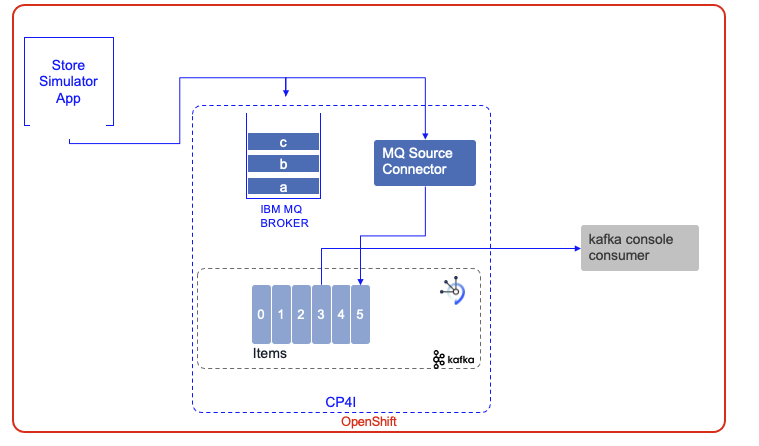

# Store inventory demonstration with IBM MQ and Event Streams

This is a gitops that let you install in a minimum set of commands a simple demonstration
that is using the following components:



* Store seller simulator
* IBM MQ as part of IBM Cloud Pak for Integration
* IBM Event Streams as part of IBM Cloud Pak for Integration
* Kafka Connector as part of Event Streams
* A simple Kafka consumer or the Event Streams console to demonstrate the items topic content.


There are two ways to use this demonstration:

* You have already a Cloud Pak for Integration deployed on OpenShift 4.7 cluster
* You have only an OpenShift 4.7+ cluster


## Audience

* Understand Event Streams, Kafka Connectors, MQ connectors

## Option 1: From Cloud Pak for Integration

You have an OpenShift Cluster with the needed resource and you already installed Cloud Pak
for integration common services and operators.

* login to OpenShift cluster
* 


## Option 2: From a OpenShift Cluster

In this option we start from a OpenShift Cluster on IBM Cloud (ROKS cluster) with minimum of three nodes.

* use `openshift-operators` project

  ```sh
  oc project openshift-operators
  ```

* Get your entitlement key from IBM site and use the following scripts to define a secret so
images for MQ and Event Streams can be downloaded the IBM image registry: 

  ```sh
  ./boostrap/scripts/defineEntitlementSecret.sh your_long_entitlement_key 
  ```

* Add IBM product catalog

  ```sh
  ./bootstrap/scripts/addIBMCatalog.sh
  ```

* Deploy OpenShift GitOps operator

  ```sh
  oc apply -k bootstrap/openshift-gitops/operator/overlays/stable
  ```

* Deploy IBM Event Streams Operator to watch all namespaces. As a first installation
it will take some time as it also install 'Cloud Pak foundational services'

  ```sh
    oc apply -k bootstrap/eventstreams
  ```

* You can verify the operator pods with 

  ```sh
  oc get pods -n openshift-operators
  ```

* Deploy IBM MQ Operator

  ```sh
    oc apply -k bootstrap/mq
  ```

* Create ArgoCD project

  ```sh
  oc apply -k bootstrap/argocd-project
  ```

* Get ArgoCD admin password

  ```sh
   oc extract secret/openshift-gitops-cluster -n openshift-gitops --to=- 
  ```

* Get ArgoCD URL, verify configuration

  ```sh
  oc get routes -n openshift-gitops
  ```

  Login to the url like: openshift-gitops-server-openshift-gitops.........appdomain.cloud 

  In the ArgoCD Setting verify the project `smq` is present.
  
  In the ArgoCD Applications, if there is other project, filter on the project named `smq`, you should see `No applications yet` message.

* Lets Go!: Start GitOps

  ```sh
   oc apply -k config/argocd 
  ```

  Now in the ArgoCD console you should see ArgoCD applications defined and after sometime all becoming green

* Go to the `smq-dev` project, in the OpenShift console, or with `oc project smq-dev`. 

* Try the following commands to assess state of the different  deployments

  ```sh
  # For event streams
   oc get eventstreams
   # For MQ
   oc get QueueManager
   ```
  